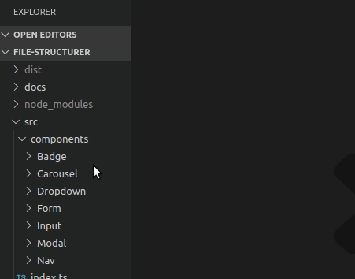
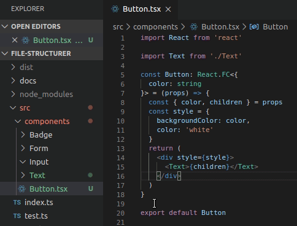

# Component Folder (VS Code Extension)

[](https://marketplace.visualstudio.com/items?itemName=dronz.vscode-component-folder)
[](https://marketplace.visualstudio.com/items?itemName=dronz.vscode-component-folder)


This extension adds some quality-of-life improvements when working with "component folders" - aka a file structure like this:

```
├── Button
│   ├── Button.spec.tsx
│   ├── Button.tsx
│   └── index.tsx
├── Card
│   ├── Card.spec.tsx
│   ├── Card.tsx
│   └── index.tsx
```

This is a common pattern for robust, fully-tested codebases in javascript, but it can make refactoring and creating new components tedious.

## Installation

Launch VS Code Quick Open (Ctrl+P), paste the following command, and press enter.

```sh
ext install dronz.vscode-component-folder
```

## Features

### New Component Folder

Adds a new context menu option for folders in the explorer. When selected it creates a new component folder within that folder using the name and file extension provided by the user.



---

### Convert To Component Folder

Adds a new context menu option for `.ts` / `.tsx` / `.js` / `.jsx` fiiles in the explorer. Creates a new component folder, copying the name and content of the file and modifying `import` statements to work from within a folder.



## Links

- [View this extension in the Visual Studio Marketplace](https://marketplace.visualstudio.com/items?itemName=dronz.vscode-component-folder&ssr=false#overview)
- [`file-structurer` package](https://www.npmjs.com/package/file-structurer)
